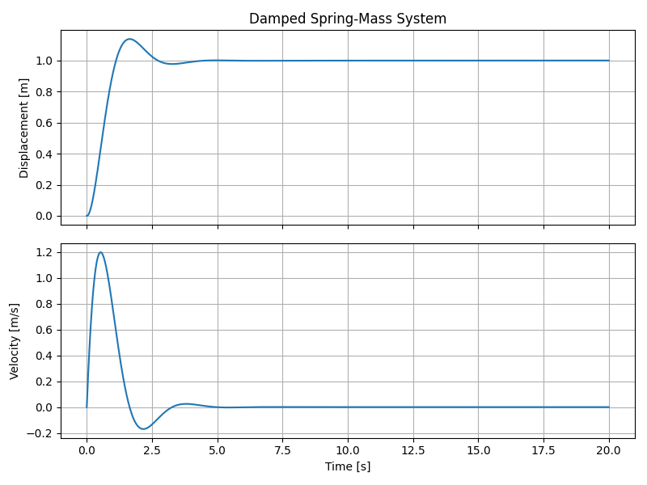

# Python Controls Sandbox
This repository is meant to experiment with controls problems in python. This is basically a learning exercise for doing things in python that I would normally do in Matlab.

